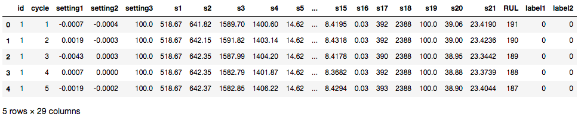
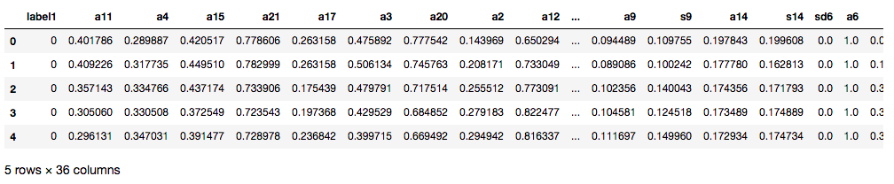
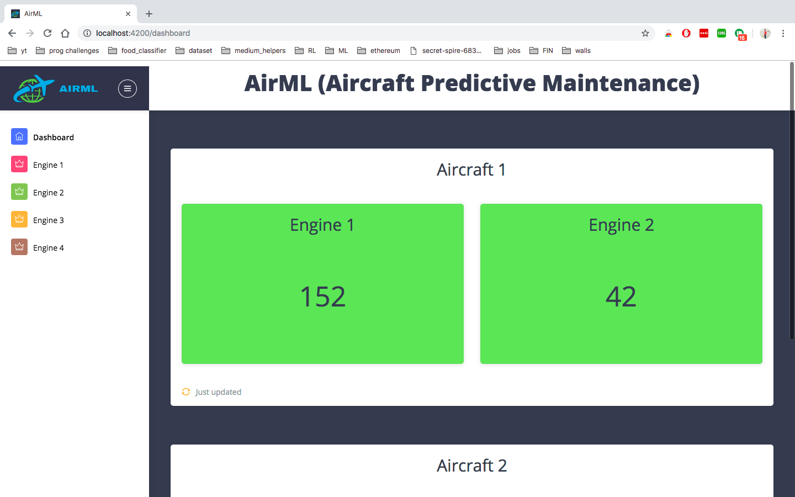
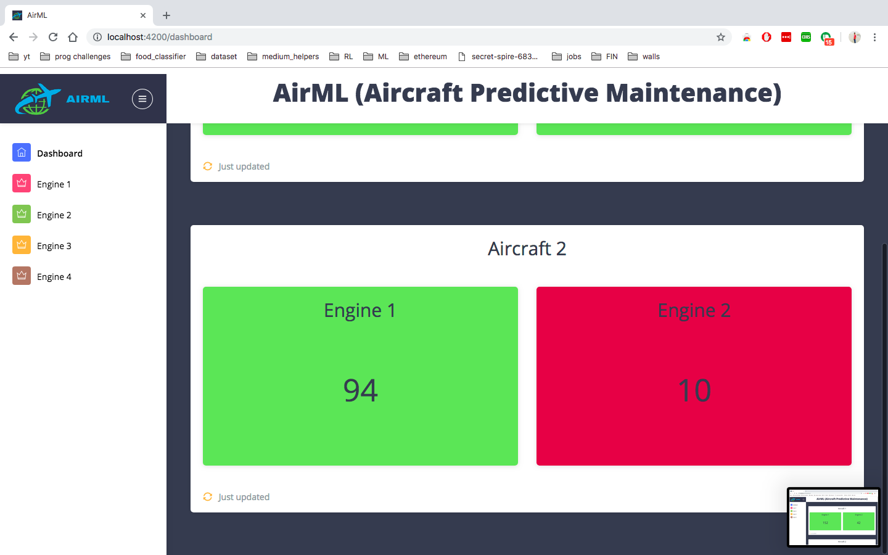
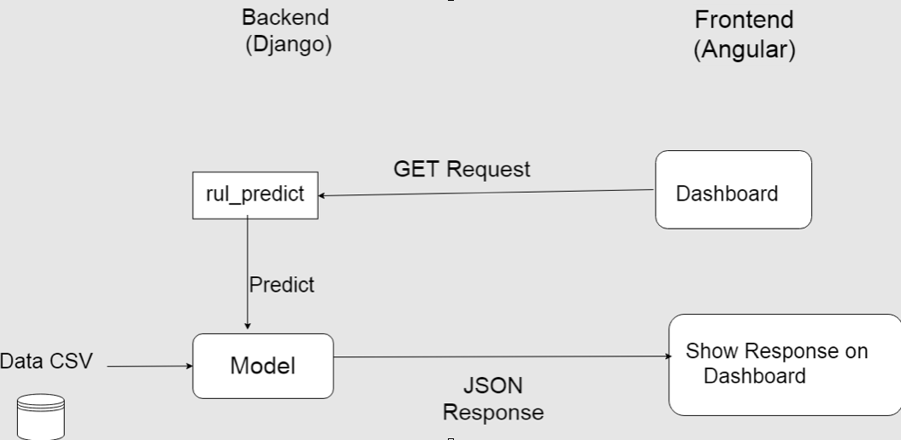

# AirML
## Using machine learning to predict the aircraft life and other parameters.

The project is divided into 3 parts. 

### 1. Training 

  The dataset used here is the [Turbofan engine degradation simulation dataset](https://ti.arc.nasa.gov/dev/tech/dash/groups/pcoe/prognostic-data-repository/#turbofan) by NASA
  
  It contains data fro 249 engines with 21 sensor readings and 3 operational settings.
  
  After data cleaning, labeling and feature engineering the data is used to feed into Machine Learning algorithms.
  
  
    
  
  
  Random Forest, XGBoost and Neural Network algorithms were tested and the best one to perform was Random Forest.

### 2. Frontend

  The frontend was built using Angular 4.
  
  First install the dependencies using `npm install` and then run the angular server use the following command `ng serve`.
  
  
  
  
  
  

### 3. Backend

  The backend is built using Django.
  
  Install the dependencies using `pip install -r requirements.txt` and then run the server using `python manage.py runserver`.

Now, goto `http://localhost:4200` to see the application running.

You can see the working of the application below

### To download the models and data directories contact me at adeshg7@gmail.com
